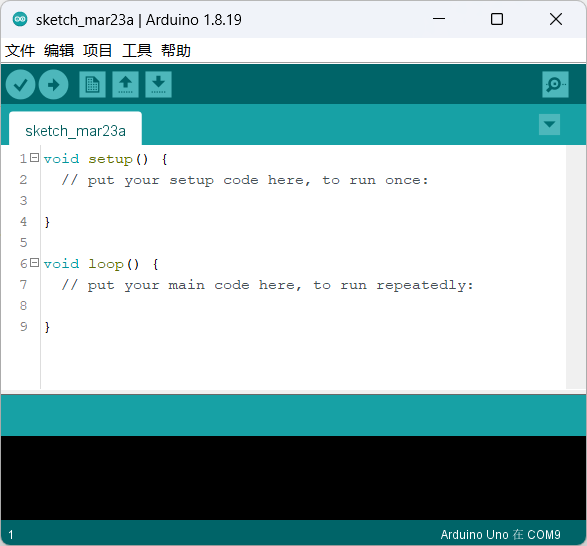

==================
1 Petoi相关资料
==================

1.1 Petoi主板信息及结构：
==========================
该部分信息在官方文档中已经有比较详细的资料，资料所在地址如下： https://docs.petoi.com/v/chinese/nyboard/nyboard-v1_1 

1.2 Petoi的配置教程：
=====================
Petoi需要进行，组装，舵机校准程序配置等过程，同样参照官方文档1~10部分的内容，该部分内容同样包括了用桌面程序对Petoi进行简单的开发： https://bittle.petoi.com/v/zhong-wen/1-gong-ju-he-zhun-bei

1.3 Arduino的基本代码结构与主要的库文件说明
==========================================
Arduino程序可以分为三个主要部分：结构，值（变量和常量）和函数。首先介绍他的结构：

1.3.1 结构：
^^^^^^^^^^^

Arduino的代码文件统称为Sketch（草图），其主要的代码结构包括两部分：

+ Setup()函数

草图启动时会调用 setup()函数。使用它来初始化变量，引脚模式，启用库等。setup函数只能在Arduino板的每次上电或复位后运行一次。

+ Loop()函数

在创建了用于初始化并设置初始值的setup()函数后，loop() 函数，正如它的名称所指，允许你的程序连续循环的更改和响应。可以使用它来主动控制Arduino板。Arduino的大部分程序的操作在这部分中运行，在进行编写时，请注意尽量减少大规模的循环的使用，而使用状态机的方式（if...else）的形式进行编写。

1.3.2 程序语言
^^^^^^^^^^^

Arduino采用的程序语言就是C/C++，仅有少量的限制和不同，我们假定您已经了解了C++的相关知识，不再做特别说明，如果想要简单入门C/C++内容，请参考： https://www.w3cschool.cn/c/

1.3.3 主要的库函数
^^^^^^^^^^^^^^^^^^

1.3.3.1 I/O函数库
---------------------

Arduino板上的引脚可以配置为输入或输出。我们将在这些模式下解释引脚的功能。重要的是要注意，大多数Arduino模拟引脚可以按照与数字引脚完全相同的方式进行配置和使用。

+ **什么是GPIO**

GPIO（General Purpose I/O Ports）意思为通用输入/输出端口，通俗地说，就是一些引脚，可以通过它们输出高低电平或者通过它们读入引脚的状态-是高电平或是低电平。
GPIO口一是个比较重要的概念，用户可以通过GPIO口和硬件进行数据交互(如UART)，控制硬件工作(如LED、蜂鸣器等),读取硬件的工作状态信号（如中断信号）等。GPIO口的使用非常广泛

+ **pinMode(pin, mode)**
通过 ``pinMode()``函数，你可以将Arduino的引脚配置为以下三种模式：

    - 输出(``OUTPUT``)模式
    - 输入(``INPUT``)模式
    -输入上拉（INPUT_PULLUP）模式 （仅支持Arduino 1.0.1以后版本）

+ 引脚配置为 ``INPUT``
Arduino引脚默认配置为输入，因此在使用它们作为输入时，不需要使用 ``pinMode()``显式声明为输入。以这种方式配置的引脚被称为处于高阻抗状态。输入引脚对采样电路的要求非常小，相当于引脚前面的100兆欧的串联电阻。

+ 引脚配置为 ``INPUT_PULLUP``
如果没有输入，上拉电阻通常用于将输入引脚引导到已知状态。这可以通过在输入端添加上拉电阻（到5V）或下拉电阻（接地电阻）来实现。10K电阻对于上拉或下拉电阻来说是一个很好的值。通过将 ``pinMode()`` 设置为 ``INPUT_PULLUP`` 可访问Arduino内置上拉电阻。相比于普通的输入模式，该输入模式的特点是，无输入的状态下读取到的为高电平。

当将传感器连接到配置为 ``INPUT_PULLUP`` 的引脚时，另一端应接地。在简单开关的情况下，这会导致当开关打开时引脚变为高电平，当按下开关时引脚为低电平。上拉电阻提供足够的电流来点亮连接到被配置为输入的引脚的LED。

+ 引脚配置为 ``OUTPUT``
通过 ``pinMode()`` 配置为 ``OUTPUT`` 的引脚被认为处于低阻抗状态。这意味着它们可以向其他电路提供大量的电流。Atmega引脚可以向其他器件/电路提供（提供正电流）或吸收（提供负电流）高达40mA（毫安）的电流。这是足以点亮LED或者运行许多传感器的电流（不要忘记串联电阻）， **但不足以运行继电器，螺线管或电机。**

代码示例：

.. code-block:: c
   :linenos:

   int button = 5 ; // button connected to pin 5
   int LED = 6; // LED connected to pin 6

   void setup () {
       pinMode(button , INPUT_PULLUP); // set the digital pin as input with pull-up resistor
       pinMode(button , OUTPUT); // set the digital pin as output
   }

   void setup () {
   If (digitalRead(button ) == LOW) // if button pressed {
       digitalWrite(LED,HIGH); // turn on led
       delay(500); // delay for 500 ms
       digitalWrite(LED,LOW); // turn off led
       delay(500); // delay for 500 ms
   }
   }

+ **digitalWrite (pin ,value)**

该函数的作用是将输出模式的pin脚写为数字信号的高/低电平，参数为：

    - ``pin``：引脚号码

    - ``value``: HIGH 或 LOW

一个通过设置输出点亮LED的示例如下：

.. code-block:: c
   :linenos:

    int LED = 6; // LED connected to pin 6

    void setup () {
    pinMode(LED, OUTPUT); // set the digital pin as output
    }

    void setup() { 
    digitalWrite(LED,HIGH); // turn on led
    delay(500); // delay for 500 ms
    digitalWrite(LED,LOW); // turn off led
    delay(500); // delay for 500 ms
    }

+ **digitalRead(pin)**

读取数字信号接口的输入，参数为：
    
    - ``pin``：引脚号码
    - ``return``：HIGH/LOW

+ **analogWrite(), analogRead()**：同理

1.3.3.2 math函数库
---------------------
请参阅： https://www.w3cschool.cn/arduino/arduino_math_library.html

1.3.3.3 串口通讯（*）
---------------------

Arduino采用USART通信模式，可以有硬串口，软串口两种实现方式。前者为硬件串口，也就是板子上的RX和TX，后者为软件模拟生成的串口

+ **硬串口**
硬串口在Arduino中已经妥善的封装为 ``Serial``类库，调用其就可以完成串口的通讯。Petoi中的钙串口所对应的就是进行烧录的串口。其中常用的函数做以下的简单说明：

+ ``Serial.begin()``

    描述：开启串口，通常置于 ``setup()``函数中。

    参数：
        - ``speed``：波特率，一般取值9600,115200等。
        - ``config``：设置数据位、校验位和停止位。默认SERIAL_8N1表示8个数据位，无校验位，1个停止位。

    返回值：无。

+ ``Serial.end()``

    描述：禁止串口传输。此时串口Rx和Tx可以作为数字IO引脚使用。

    参数：无。

    返回值：无。

+ ``Serial.print()``

    描述：串口输出数据，写入字符数据到串口。

    参数：
        - ``val``：打印的值，任意数据类型。
        - ``config``：输出的数据格式。BIN(二进制)、OCT(八进制)、DEC(十进制)、HEX(十六进制)。对于浮点数，此参数指定要使用的小数位数。

+ ``Serial.println()``

    描述：串口输出数据并换行。

    参数：
        - ``val``：打印的值，任意数据类型。
        - ``config``：输出的数据格式。

    返回值：返回写入的字节数。

+ ``Serial.available()``

    描述：判断串口缓冲区的状态，返回从串口缓冲区读取的字节数。

    参数：无。

    返回值：可读取的字节数。

+ ``Serial.read()``

    描述：读取串口数据，一次读一个字符，读完后删除已读数据。

    参数：无。

    返回值：返回串口缓存中第一个可读字节，当没有可读数据时返回-1，整数类型。

一个简单的示例如下，其将通过命令行得到的输入通过串口在发送出来：

.. code-block:: c
   :linenos:
   
    String str="";

    void setup() {
    Serial.begin(9600); //set up serial library baud rate to 9600
    }

    void loop() {
    str = "";
    while (Serial.available() > 0)
    {
        str += char(Serial.read());
        delay(10);
    }
    if (str.length() > 0)
    {
        Serial.print(F("Messages："));
        Serial.println(str);
    }
    }

仅有一个串口显然是不够使用的，所以Arduino还为我们提供了一些替代方案，将开发板的一些pin脚通过软件模拟的方式复用为UART串口，这一部分的函数被封装在 ``SoftwareSerial.h`` 的库文件中。该部分所复用的串口波特率不稳定，且容易出错，但能拓展可用的串口，如非不得已不推荐使用，函数功能与 ``Serial`` 类似，在此不做单独说明，其具体函数实现请查阅 ``SoftwareSerial.h``

1.3.3.4 常用的系统函数
-----------------------
时间运行函数

        ``millis( )`` 、 ``micros( )`` 获取 Arduino 通电后（或复位后）到现在的时间，单位毫秒（ms）。

延时函数

        Arduino 提供了毫秒级和微秒级两种延时函数。运行延时函数时，会等待指定的时间，再运行此后的程序。

``delay(ms)``
// 此函数为毫秒级延时。参数为时长，类型unsigned long

``delayMicroseconds(us)``
// 此函数为微秒级延时。参数为时长,类型unsigned int

常用的库函数还包括 ``wire(I2C)`` 类， ``SPI`` 类等，如需了解请查阅 https://wiki.arduino.cn/?file=home-首页

**了解了以上的函数，再随时查阅相关文档，就能够进行简单的Petoi开发了。下一节介绍了Petoi的库OpenCat的代码结构，暂时不需要进行了解，可先查看后续例程**

1.4 Petoi程序设计（OpenCat）框架（搬运，施工中）
==================================================

1.4.1 了解OpenCat的文件结构
^^^^^^^^^^^^^^^^^^^^^^^^^^^^^^^^^^^^^^^^^^^^^^^^^^

机器狗所采用的框架OpenCat的框架文件夹的结构如下，主要使用的目录已经加粗：

+ OpenCat
    + ModuleTests           //这个文件夹存放了用来测试主板各个功能的程序
    + pyUI                  //这个文件夹是可视化桌面程序的py源码，这部分代码基本不用修改
    + Resources             //这个文件夹放置了一些关于方针和开发板的资源
        - Nyboard           //开发板的bootloader引导程序，以及资源定义，可以更改电路板定义等，用不到
        - SimulationModels  //用来在电脑上对其进行模拟仿真，参考(完蛋，参考找不见了)
    + SkillLibrary          //存放了经过官方实验的一些动作组，需要的话可以进去抄
    + Seiralmaster          //通过串口控制的相关代码和一些示例脚本
    + **src**               //存放源码的文件夹，进行修改的主要文件都在里面，里面的文件基本上可说是字如其名
    + **OpenCat.ino**       //主程序代码，OpenCat的基本程序框架，改代码的主要地方

1.4.2 了解OpenCat的控制方式：token与cmd
^^^^^^^^^^^^^^^^^^^^^^^^^^^^^^^^^^^^^^^^^^^^^^^^^^
Opencat提供了多种token来完成不同的动作，比如执行动作，蜂鸣器，重启等等，相关的代码都在 ``OpenCat.h`` 中被声明如下：

.. code-block:: c
   :linenos: 

    #define T_ABORT       'a'
    #define T_BEEP        'b'
    #define T_CALIBRATE   'c'
    #define T_REST        'd'
    #define T_GYRO        'g'
    #define T_HELP        'h'
    #define T_INDEXED_SIMULTANEOUS_ASC 'i'
    #define T_JOINTS      'j'
    #define T_SKILL       'k'
    #define T_MOVE_ASC    'm'
    #define T_MELODY      'o'
    #define T_PAUSE       'p'
    #define T_RAMP        'r'
    #define T_SAVE        's'
    #define T_TILT        't'
    #define T_MEOW        'u'

在这里提供一个使用其蜂鸣器的代码示例：

.. code-block:: c
   :linenos: 

    int8_t melody[] = {15, 2, 8, 4, 10, 4, 12, 4, 13, 4, 15, 2, 8, 2, 8, 2, 0,};
    cmdLen = strlen(melody);
    arrayNCPY(dataBuffer, melody, cmdLen);
    token = T_BEEP_BIN;

``dataBuffer`` 是用来储存所接收到的数据的一个寄存器， ``arrayNCPY`` 的功能大概可以看作人为的模拟了一个类似于串口接收到数据的操作，只不过这里的数据实际上并不是通过串口传输过来的而是通过程序写入的。

将数据存入 ``Buffer`` 后，缓冲待用；这是通过token = T_BEEP_BIN给出蜂鸣器的指令，开发板就会从 ``Buffer`` 中读取数据，然后根据数据执行蜂鸣器的指令操作。

token中很多指令是为了开发板硬件功能调试而设计的，如果只是进行机器狗控制的话，其中较为常有的指令还有 ``T_SKILL`` 作用是使机器狗执行相关的动作，其基本的思路于蜂鸣器的调用相同，但略有区别，代码示例如下：

.. code-block:: c
   :linenos: 

   strcpy(newCmd, "zero");
   token = T_SKILL;

相比于蜂鸣器，动作指令更像是向机器狗发布了一条cmd指令，在 ``OpenCat.h`` 中专门封装了一些变量用于token的指令搭配使用，这里使用的newCmd就是其中之一。