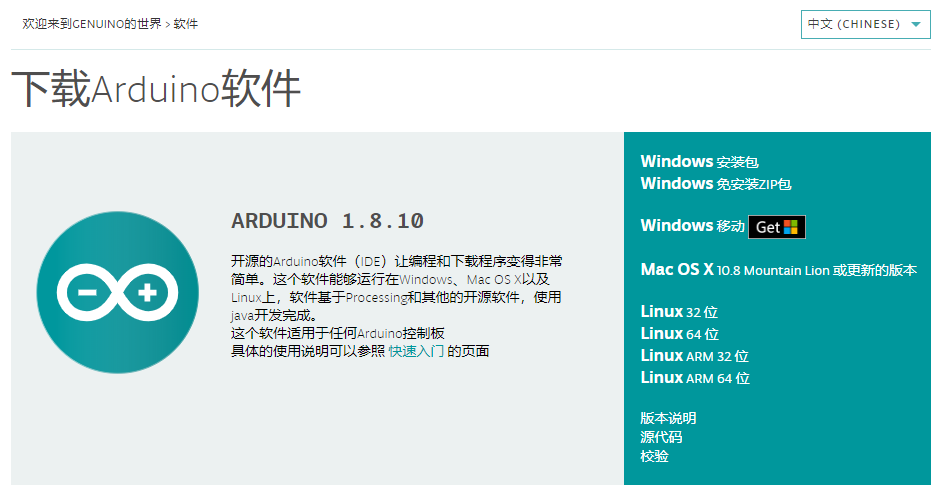
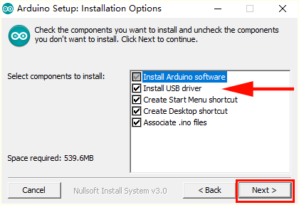
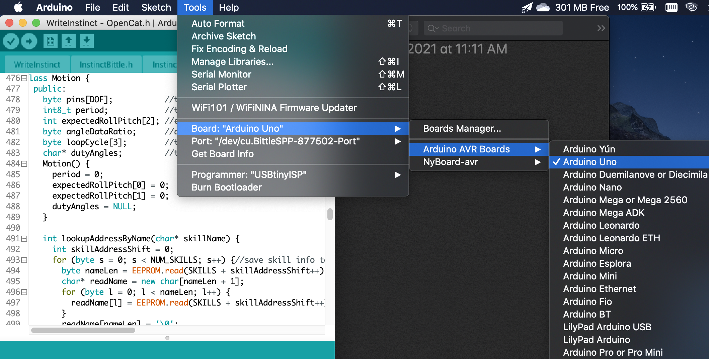
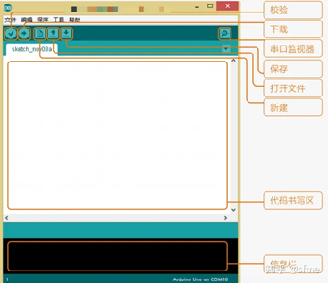
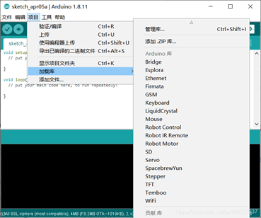

=============
2 Arduino IDE
=============

Arduino本身的中文文档很完善，有很好的参考意义且十分全面，如果像更详细的了解Arduino可以访问: http://arduino.com.cn/docs/documentation/ 

2.1 Arduino IDE的安装
=====================
**下载Arduino IDE**

在Arduino官方网站上 https://www.arduino.cc/cn/Main/Software 下载最新版本的Arduino IDE，对于windows操作系统，推荐下载windows安装包。

之后按照顺序和引导完成安装即可，为了方便安装后的使用，建议同时进行驱动的安装，在如下界面时请勾选 ``Install USB driver``
选项，如下图：

Petoi的核心板为UNO，按照如图的方式选择开发板的类型：

如果不能找到相对应的串口，请通过以下方式下载串口芯片的驱动CH340/CH341：

Mac: http://www.wch.cn/download/CH341SER_MAC_ZIP.html

Windows: http://www.wch.cn/download/CH341SER_EXE.html

2.2 Arduino IDE的界面
=====================

了解ArduinoIDE，下图标出了其界面以及主要的功能：

在工具选项中，选择对应的板卡型号（此处为UNO）并选择对应的端口，来准备烧录。主菜单栏的文件->示例中提供了Arduino的一些基础示例，可供参考。下方的信息栏会输出程序的相应情况，包括编译和上传的进度和可能出现的worning和报错，为了更全面的显示，建议在文件->首选项中勾选编译和输出。

为了方便调用Arduino封装的各种库，IDE提供了加载库的功能：

在项目-加载库中选择自己所需要的库，就可以自动加入项目中。项目->加载库->管理库，可搜索安装网络中各种支持库，选中需要安装的库点击安装即可在线下载安装。
完成代码的书写后，点击对勾来对程序文件进行编译，点击箭头将程序上传到开发板上。

**串口助手：**
Arduino提供了十分方便的串口助手，来帮助我们进行与Arduino的串口通讯。点击工具->串口监视器来打开串口助手。串口监视器的作用是接收Arduino发送到电脑的数据，并显示在监视器中 可以设置接受的波特率，换行符，自动滚屏等。具体的设置于使用，会在之后的Petoi实例中介绍。